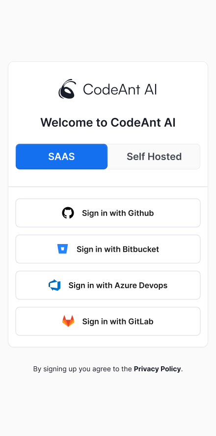
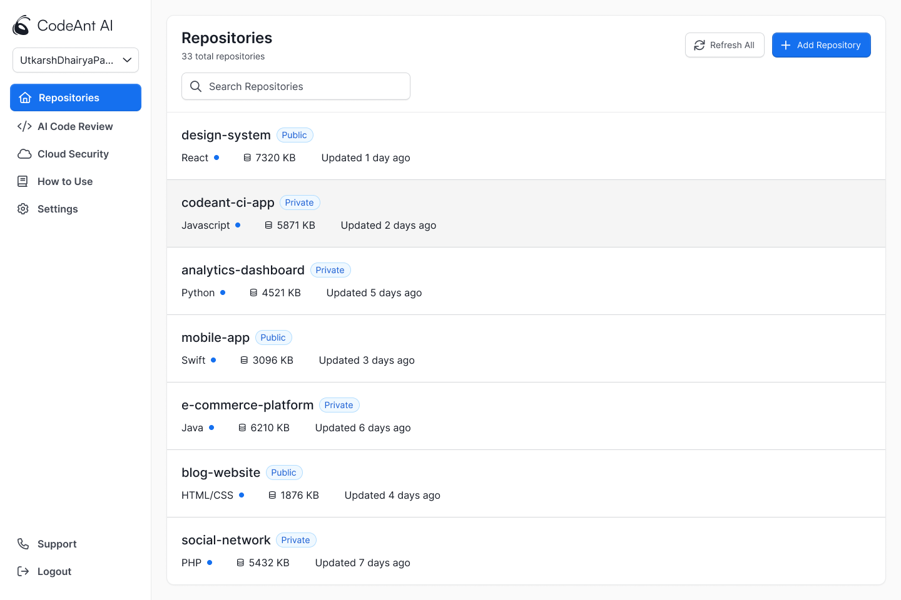
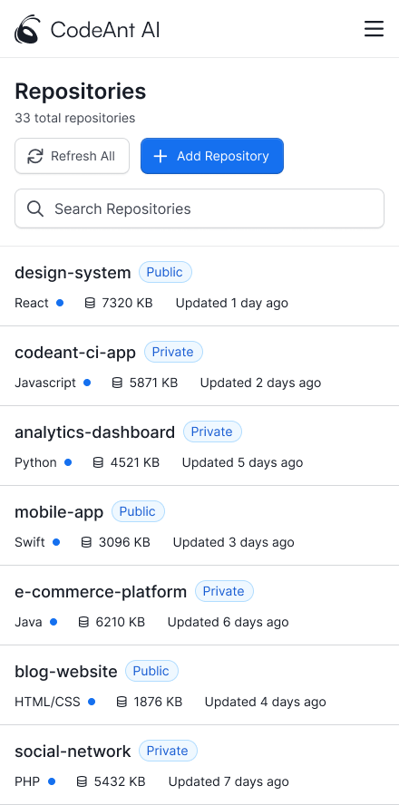
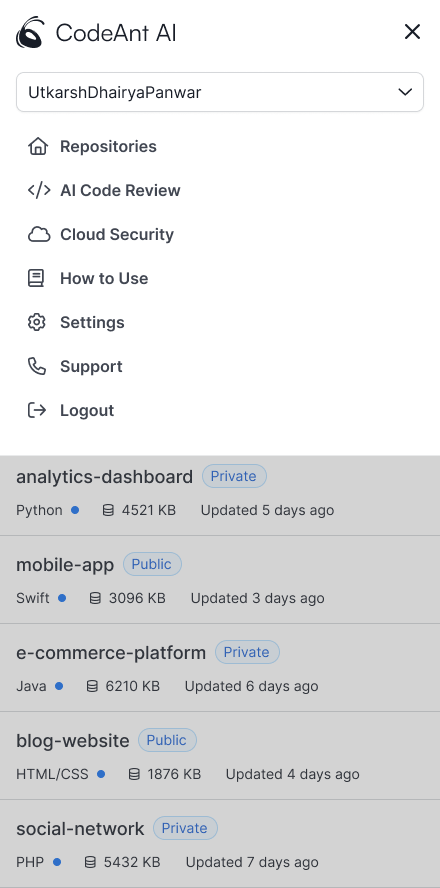

# Codeant.ai - Frontend Developer Intern Hiring Assignment

This project was bootstrapped with [Create React App](https://github.com/facebook/create-react-app).

This repo submitted to Codeant.

Here is the sample image which need to code in React.

Apply Link : <a href="https://drive.google.com/drive/folders/1m1fq7Mqlr4iq9I6_wQvZeZgyROrrDpOC"> Here </a>

Figma File link: <a href="https://www.figma.com/design/3j3bEI8nR1T1UwsfEBMbhi/Frontend-Developer-%3C%3E-CodeAnt?node-id=0-1&t=jN2Ajnc3ZzYZfEBs-1">Link </a>

## Login Page

## Dashboard

## How to check

1. Clone the repository
2. Run `npm install` to install the dependencies
3. Run `npm start` for preview.
   Runs the app in the development mode.\
   Open [http://localhost:3000](http://localhost:3000) to view it in your browser.

Thank You!
Happy Coding!
